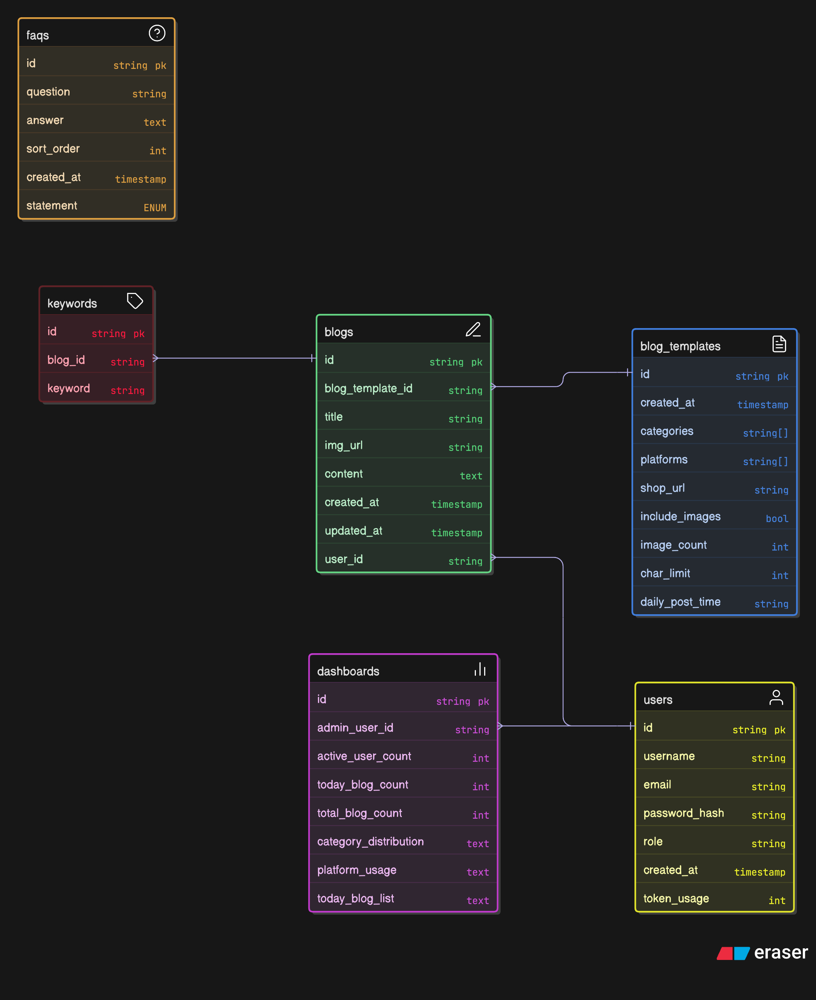
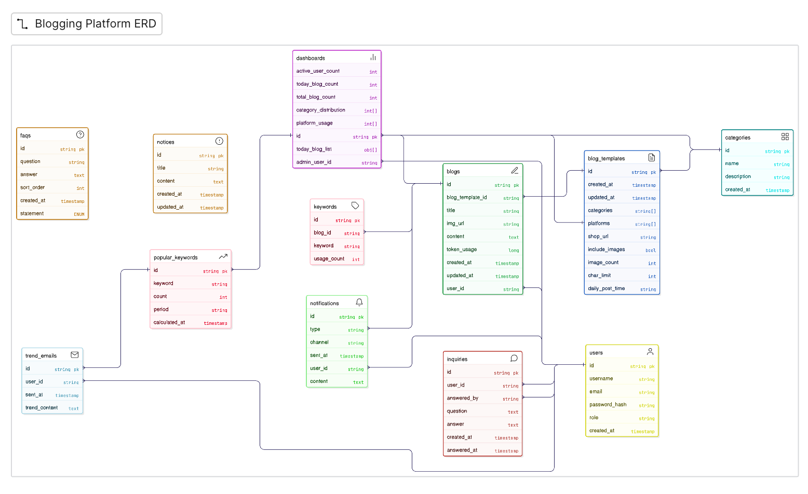

# 도메인 아키텍처 설계

## 1. 프로젝트 개요

### 목적
AI 기반 블로그 자동 생성 및 관리 플랫폼으로, 사용자가 쇼핑몰 URL을 기반으로 AI가 생성한 블로그 글을 주기적으로 받을 수 있는 서비스입니다.

### 기술 스택
- **Backend**: Spring Boot 3.5.7, Java 21
- **Database**: PostgreSQL
- **AI**: Spring AI + OpenAI (GPT-3.5-turbo)
- **External API**: Musinsa API (현재 url은 매거진을 가져옴으로 변경이 필요), 추후 확장 가능

### 개발 단계
- **v1**: 기본 블로그 생성 및 관리 기능
- **v2**: 알림, 문의, 카테고리 확장 등 고급 기능

---

## 2. ERD 분석

### v1 엔티티
```
users (사용자)
├─ id (PK)
├─ username
├─ email
├─ password
├─ role (ENUM)
├─ created_at
├─ updated_at 
└─ token_usage (long)

blog_templates (블로그 템플릿)
├─ id (PK)
├─ created_at
├─ categories (array)
├─ platforms (array)
├─ shop_url
├─ include_images (bool)
├─ image_count (int)
├─ char_limit (int)
└─ daily_post_time (string)

blogs (블로그 글)
├─ id (PK)
├─ blog_template_id (FK)
├─ user_id (FK)
├─ title
├─ img_url
├─ content (text)
├─ created_at
└─ updated_at

keywords (키워드)
├─ id (PK)
├─ blog_id (FK)
└─ keyword

dashboards (관리자 대시보드)
├─ id (PK)
├─ admin_user_id (FK)
├─ active_user_count
├─ today_blog_count
├─ total_blog_count
├─ category_distribution (text)
├─ platform_usage (text)
└─ today_blog_list (text)

faqs (자주 묻는 질문)
├─ id (PK)
├─ question
├─ answer (text)
├─ sort_order
├─ created_at
└─ statement (ENUM)
```

### v2 추가 엔티티
```
categories (카테고리 확장)
├─ id (PK)
├─ name
├─ description
└─ created_at

notifications (알림)
├─ id (PK)
├─ user_id (FK)
├─ type (string)
├─ channel (string)
├─ sent_at
└─ content (text)

popular_keywords (인기 키워드)
├─ id (PK)
├─ keyword
├─ count
├─ period
└─ calculated_at

trend_emails (트렌드 이메일)
├─ id (PK)
├─ user_id (FK)
├─ sent_at
└─ trend_content (text)

inquiries (문의)
├─ id (PK)
├─ user_id (FK)
├─ question (text)
├─ answer (text)
├─ created_at
├─ answered_at
└─ answered_by

notices (공지사항)
├─ id (PK)
├─ title
├─ content (text)
├─ created_at
└─ updated_at

blog_templates (v2 업데이트)
└─ updated_at 추가
```

---

## 3. 도메인 설계

### 3.1 Layered Architecture 구조
```
io.github.cryschan.berepository
├─ domain
│  ├─ user         # 사용자 도메인
│  ├─ blog         # 블로그 도메인
│  ├─ admin        # 관리자 도메인
│  ├─ notification # 알림 도메인 (v2)
│  ├─ category     # 카테고리 도메인 (v2)
│  ├─ analytics    # 분석 도메인 (v2)
│  ├─ ai           # AI 서비스 (기존)
│  └─ fashion      # 패션 API 통합 (기존)
├─ _global
│  ├─ config       # 설정
│  ├─ security     # 보안
│  ├─ exception    # 예외 처리
│  └─ util          # 유틸리티
└─ infrastructure
   ├─ client       # 외부 API 클라이언트
   └─ scheduler    # 스케줄러 (v2)
```

### 3.2 도메인별 세부 구조

#### 각 도메인의 표준 레이어
```
domain/{domain-name}
├─ entity          # JPA 엔티티
├─ exception       # 도메인별 예외 클래스
├─ repository      # Repository 인터페이스
├─ service         # 비즈니스 로직
├─ controller      # API 컨트롤러
└─ dto
   ├─ request      # 요청 DTO
   └─ response     # 응답 DTO
```

---

## 4. v1 도메인 상세 설계

### 4.1 User Domain (사용자)

**책임**
- 회원가입, 로그인 (인증/인가)
- 사용자 정보 관리 (CRUD)
- 토큰 사용량 추적
- 권한 관리 (USER, ADMIN)

**주요 엔티티**
- `User`: 사용자 기본 정보

**주요 기능**
- `POST /api/v1/auth/register`: 회원가입
- `POST /api/v1/auth/login`: 로그인 (JWT)
- `GET /api/v1/users/me`: 내 정보 조회
- `PUT /api/v1/users/me`: 내 정보 수정
- `GET /api/v1/users/me/usage`: 토큰 사용량 조회

**기술 고려사항**
- Spring Security + JWT 기반 인증
- BCryptPasswordEncoder로 비밀번호 암호화
- Role 기반 권한 관리 (USER, ADMIN)

**나중에 추가되어야할 사용자 기능**
- 사용자는 자신이 작성한 글을 볼 수 있어야한다.

---

### 4.2 Blog Domain (블로그)

**책임**
- 블로그 템플릿 관리 (설정)
- AI 기반 블로그 글 생성
- 블로그 글 CRUD
- 키워드 관리

**주요 엔티티**
- `BlogTemplate`: 블로그 생성 템플릿 설정
- `Blog`: 생성된 블로그 글
- `Keyword`: 블로그 키워드

**주요 기능**
- `POST /api/v1/blog-templates`: 템플릿 생성/수정
- `GET /api/v1/blog-templates/me`: 내 템플릿 조회
- `POST /api/v1/blogs/generate`: AI 블로그 생성 (AI 연동)
- `GET /api/v1/blogs`: 블로그 목록 조회 (페이징)
- `GET /api/v1/blogs/{id}`: 블로그 상세 조회
- `PUT /api/v1/blogs/{id}`: 블로그 수정
- `DELETE /api/v1/blogs/{id}`: 블로그 삭제

**BlogTemplate 설정 항목**
```java
@Entity
public class BlogTemplate {
    @Id @GeneratedValue
    private String id;
    
    @ManyToOne
    private User user;  // 템플릿 소유자
    
    private String[] categories;      // 예: ["상의", "하의", "신발"]
    private String[] platforms;       // 예: ["무신사", "29CM"]
    private String shopUrl;           // 쇼핑몰 URL
    private boolean includeImages;    // 이미지 포함 여부
    private int imageCount;           // 이미지 개수
    private int charLimit;            // 글자 수 제한
    private String dailyPostTime;     // 매일 생성 시간 (v2에서 스케줄링)
    private LocalDateTime createdAt;
}
```

**기술 고려사항**
- AI 서비스와 통합 (Spring AI + OpenAI)
- 패션 API (Musinsa) 데이터 크롤링/수집
- 키워드 자동 추출 로직

---

### 4.3 Admin Domain (관리자)

**책임**
- 관리자 대시보드 데이터 제공
- FAQ 관리
- 사용자 통계 집계
- 플랫폼 사용 현황

**주요 엔티티**
- `Dashboard`: 대시보드 스냅샷
- `FAQ`: 자주 묻는 질문

**주요 기능**
- `GET /api/v1/admin/dashboard`: 대시보드 데이터 조회
- `GET /api/v1/faqs`: FAQ 목록 조회 (공개)
- `POST /api/v1/admin/faqs`: FAQ 생성 (관리자)
- `PUT /api/v1/admin/faqs/{id}`: FAQ 수정 (관리자)
- `DELETE /api/v1/admin/faqs/{id}`: FAQ 삭제 (관리자)

**대시보드 집계 항목**
- 활성 사용자 수 (active_user_count)
- 오늘 생성된 블로그 수 (today_blog_count)
- 전체 블로그 수 (total_blog_count)
- 카테고리별 분포 (category_distribution)
- 플랫폼 사용 현황 (platform_usage)
- 오늘 생성된 블로그 목록 (today_blog_list)

**기술 고려사항**
- 관리자 권한 체크 (@PreAuthorize("hasRole('ADMIN')"))
- 대시보드 데이터는 주기적 집계 or 실시간 조회 (성능 고려)
- FAQ는 정렬 순서(sort_order) 지원

---

## 5. v2 도메인 상세 설계

### 5.1 Notification Domain (알림)

**책임**
- 블로그 생성 알림 발송
- 주기적 AI 요약 이메일 발송
- 알림 이력 관리

**주요 엔티티**
- `Notification`: 알림 이력
- `TrendEmail`: 트렌드 요약 이메일

**주요 기능**
- `POST /api/v1/notifications/subscribe`: 알림 구독 설정
- `GET /api/v1/notifications`: 알림 이력 조회
- 스케줄러: 매일 설정 시간에 블로그 생성 + 이메일 발송
- 스케줄러: 주간/월간 트렌드 요약 이메일

**기술 고려사항**
- Spring Boot Mail (SMTP)
- Spring Scheduler 또는 Quartz
- 이메일 템플릿 엔진 (Thymeleaf)

---

### 5.2 Category Domain (카테고리 확장)

**책임**
- 의류 외 다양한 상품 카테고리 관리
- 카테고리별 블로그 생성

**주요 엔티티**
- `Category`: 카테고리 마스터 데이터

**주요 기능**
- `GET /api/v1/categories`: 카테고리 목록 조회
- `POST /api/v1/admin/categories`: 카테고리 생성 (관리자)
- BlogTemplate에 Category FK 추가

**카테고리 확장 예시**
- 패션 (의류, 신발, 액세서리)
- 전자제품 (스마트폰, 노트북, 가전)
- 뷰티 (화장품, 향수, 스킨케어)
- 라이프스타일 (가구, 인테리어)

---

### 5.3 Analytics Domain (분석)

**책임**
- 인기 키워드 추적
- 트렌드 분석

**주요 엔티티**
- `PopularKeyword`: 인기 키워드 통계

**주요 기능**
- `GET /api/v1/analytics/keywords/popular`: 인기 키워드 조회
- 스케줄러: 주기적으로 키워드 집계

---

### 5.4 Inquiry Domain (문의)

**책임**
- 사용자 문의 관리
- 관리자 답변 처리

**주요 엔티티**
- `Inquiry`: 문의

**주요 기능**
- `POST /api/v1/inquiries`: 문의 생성 (사용자)
- `GET /api/v1/inquiries/me`: 내 문의 목록 조회
- `GET /api/v1/admin/inquiries`: 전체 문의 조회 (관리자)
- `PUT /api/v1/admin/inquiries/{id}/answer`: 답변 작성 (관리자)

---

### 5.5 Notice Domain (공지사항)

**책임**
- 공지사항 게시판 관리

**주요 엔티티**
- `Notice`: 공지사항

**주요 기능**
- `GET /api/v1/notices`: 공지사항 목록 조회 (페이징)
- `GET /api/v1/notices/{id}`: 공지사항 상세 조회
- `POST /api/v1/admin/notices`: 공지사항 작성 (관리자)
- `PUT /api/v1/admin/notices/{id}`: 공지사항 수정 (관리자)
- `DELETE /api/v1/admin/notices/{id}`: 공지사항 삭제 (관리자)

---

## 6. 공통 인프라 설계

### 6.1 AI Service (기존 확장)

**현재 구조**
- `AiService`: OpenAI API 호출
- `AiController`: AI 테스트 엔드포인트

**v1 확장**
- Blog 생성 시 AI 프롬프트 최적화
- 카테고리/플랫폼 정보 기반 맞춤형 글 생성
- 키워드 자동 추출 기능

**프롬프트 예시**
```
사용자가 설정한 정보:
- 카테고리: 상의
- 플랫폼: 무신사
- 쇼핑몰 URL: https://example.com
- 글자 수 제한: 1000자
- 이미지 포함 여부: true

최신 트렌드를 반영한 블로그 글을 작성해주세요.
```

---

### 6.2 Fashion API Service (기존 확장)

**현재 구조**
- `MusinsaController`: 무신사 API 호출
- `MagazineService`: 매거진 데이터 수집

**v1 확장**
- BlogTemplate의 shopUrl 기반 상품 정보 크롤링
- 카테고리별 인기 상품 데이터 수집
- AI 블로그 생성 시 상품 데이터 전달

**v2 확장**
- 다양한 플랫폼 지원 (29CM, W컨셉 등)
- 통합 API 추상화 계층

---

### 6.3 Security

**인증/인가**
- Spring Security + JWT
- `/api/v1/auth/**`: 인증 불필요
- `/api/v1/admin/**`: ADMIN 권한 필요
- 나머지 API: USER 권한 필요

**JWT 구성**
```json
{
  "sub": "user_id",
  "role": "USER",
  "iat": 1234567890,
  "exp": 1234567890
}
```

---

## 7. 구현 계획

### 7.1 v1 구현 우선순위

**Phase 1: 인증/인가 기반 구축 (1주)**
1. User Domain 구현
   - User 엔티티 + Repository
   - Spring Security 설정
   - JWT 인증 구현
   - 회원가입/로그인 API
   - 내 정보 조회/수정 API

2. Global Exception Handler 구현
   - 통합 예외 처리
   - 커스텀 예외 클래스

**Phase 2: 블로그 핵심 기능 (2주)**
1. Blog Domain 구현
   - BlogTemplate 엔티티
   - Blog 엔티티
   - Keyword 엔티티
   - CRUD API

2. AI 통합
   - 기존 AiService 확장
   - Blog 생성 프롬프트 최적화
   - 키워드 자동 추출

3. Fashion API 통합
   - 기존 MagazineService 확장
   - 상품 데이터 수집
   - BlogTemplate 기반 데이터 가져오기

**Phase 3: 관리자 기능 (1주)**
1. Admin Domain 구현
   - Dashboard 엔티티 + 집계 로직
   - FAQ 엔티티
   - 관리자 API
   - 권한 체크

**Phase 4: 테스트 및 최적화 (1주)**
1. 단위 테스트 작성
2. 통합 테스트
3. 성능 최적화
4. API 문서화 (Swagger/OpenAPI)

---

### 7.2 v2 구현 우선순위

**Phase 1: 알림 시스템 (2주)**
1. Notification Domain 구현
   - 이메일 서비스 설정 (Spring Mail)
   - 알림 엔티티
   - 블로그 생성 알림
   
2. 스케줄러 구현
   - Spring Scheduler 설정
   - 매일 정해진 시간 블로그 자동 생성
   - 주간/월간 트렌드 이메일 발송

**Phase 2: 카테고리 확장 (1주)**
1. Category Domain 구현
   - Category 엔티티
   - BlogTemplate에 Category 연결
   - 다양한 플랫폼 지원

**Phase 3: 문의/공지 시스템 (1주)**
1. Inquiry Domain 구현
2. Notice Domain 구현

**Phase 4: 분석 기능 (1주)**
1. Analytics Domain 구현
   - 인기 키워드 집계
   - 트렌드 분석

---

## 8. 기술적 고려사항

### 8.1 데이터베이스

**인덱싱 전략**
```sql
-- 자주 조회되는 컬럼에 인덱스
CREATE INDEX idx_blogs_user_id ON blogs(user_id);
CREATE INDEX idx_blogs_created_at ON blogs(created_at);
CREATE INDEX idx_keywords_blog_id ON keywords(blog_id);
CREATE INDEX idx_blog_templates_user_id ON blog_templates(user_id);
```

**페이징 처리**
- Spring Data JPA Pageable 사용
- 블로그 목록, 공지사항 등에 적용

---

### 8.2 성능 최적화

**N+1 문제 해결**
- Fetch Join 활용
- @EntityGraph 사용

**캐싱**
- Spring Cache (Redis or Caffeine)
- FAQ 목록, 카테고리 목록 등 자주 조회되는 데이터

**비동기 처리**
- AI 블로그 생성: @Async 비동기 처리
- 이메일 발송: 비동기 처리

---

### 8.3 API 설계 원칙

**RESTful API 가이드**
- `GET`: 조회
- `POST`: 생성
- `PUT`: 전체 수정
- `PATCH`: 부분 수정
- `DELETE`: 삭제

**응답 형식 표준화**
```json
{
  "success": true,
  "data": { ... },
  "message": "성공",
  "timestamp": "2025-01-19T12:00:00"
}
```

**에러 응답 표준화**
```json
{
  "success": false,
  "error": {
    "code": "USER_NOT_FOUND",
    "message": "사용자를 찾을 수 없습니다.",
    "details": []
  },
  "timestamp": "2025-01-19T12:00:00"
}
```

---

### 8.4 보안 고려사항

**입력 검증**
- Bean Validation (@NotNull, @Email, @Size 등)
- 커스텀 Validator 추가 가능

**SQL Injection 방지**
- JPA Parameter Binding 사용
- Native Query 사용 시 주의

**XSS 방지**
- 입력 데이터 sanitization
- Content-Type 검증

**비밀번호 정책**
- 최소 8자 이상
- 영문, 숫자, 특수문자 조합
- BCrypt로 암호화

**Rate Limiting**
- Spring Cloud Gateway or Bucket4j
- AI API 호출 제한 (토큰 사용량 추적)

---

### 8.5 모니터링 및 로깅

**로깅 전략**
- Logback + SLF4J
- 로그 레벨: ERROR, WARN, INFO, DEBUG
- 민감 정보 마스킹 (비밀번호, 토큰 등)

**모니터링**
- Spring Boot Actuator
- 헬스체크: `/actuator/health`
- 메트릭: `/actuator/metrics`

**추후 고려**
- ELK Stack (Elasticsearch + Logstash + Kibana)
- Prometheus + Grafana

---

## 9. 의존성 추가 계획

### v1 필요 의존성
```gradle
dependencies {
    // 기존 의존성
    implementation 'org.springframework.boot:spring-boot-starter-web'
    implementation 'org.springframework.boot:spring-boot-starter-data-jpa'
    implementation 'org.springframework.boot:spring-boot-starter-validation'
    implementation 'org.springframework.boot:spring-boot-starter-actuator'
    implementation 'org.springframework.ai:spring-ai-openai-spring-boot-starter:1.0.0-M4'
    runtimeOnly 'org.postgresql:postgresql'
    
    // 추가 필요
    implementation 'org.springframework.boot:spring-boot-starter-security'
    implementation 'io.jsonwebtoken:jjwt-api:0.12.3'
    runtimeOnly 'io.jsonwebtoken:jjwt-impl:0.12.3'
    runtimeOnly 'io.jsonwebtoken:jjwt-jackson:0.12.3'
    
    // API 문서화
    implementation 'org.springdoc:springdoc-openapi-starter-webmvc-ui:2.3.0'
    
    // 유틸리티
    implementation 'org.apache.commons:commons-lang3:3.14.0'
}
```

### v2 추가 의존성
```gradle
dependencies {
    // 이메일
    implementation 'org.springframework.boot:spring-boot-starter-mail'
    
    // 템플릿 엔진 (이메일용)
    implementation 'org.springframework.boot:spring-boot-starter-thymeleaf'
    
    // 스케줄링 (기본 포함, 명시적으로 설정)
    // @EnableScheduling으로 활성화
    
    // 캐싱 (선택)
    implementation 'org.springframework.boot:spring-boot-starter-cache'
    implementation 'com.github.ben-manes.caffeine:caffeine:3.1.8'
    // or
    // implementation 'org.springframework.boot:spring-boot-starter-data-redis'
}
```

---

## 10. 배포 전략

### 개발 환경
- Local: Docker Compose (PostgreSQL)
- Profile: `dev`
- DDL: `update` or `create-drop`

### 프로덕션 환경
- Profile: `prod`
- DDL: `validate` (Flyway/Liquibase 사용 권장)
- 환경변수로 민감 정보 관리

### Docker 구성 (기존 유지)
```yaml
# docker-compose.yml
services:
  postgres:
    image: postgres:16-alpine
    environment:
      POSTGRES_DB: blog_db
      POSTGRES_USER: admin
      POSTGRES_PASSWORD: password
    ports:
      - "5432:5432"
      
  app:
    build: .
    environment:
      DB_HOST: postgres
      OPENAI_API_KEY: ${OPENAI_API_KEY}
    ports:
      - "8080:8080"
    depends_on:
      - postgres
```

---

## 11. API 엔드포인트 요약

### v1 API

#### 인증 (Auth)
| Method | Endpoint | Description | Auth |
|--------|----------|-------------|------|
| POST | /api/v1/auth/register | 회원가입 | Public |
| POST | /api/v1/auth/login | 로그인 | Public |

#### 사용자 (User)
| Method | Endpoint | Description | Auth |
|--------|----------|-------------|------|
| GET | /api/v1/users/me | 내 정보 조회 | USER |
| PUT | /api/v1/users/me | 내 정보 수정 | USER |
| GET | /api/v1/users/me/usage | 토큰 사용량 조회 | USER |

#### 블로그 템플릿 (Blog Template)
| Method | Endpoint | Description | Auth |
|--------|----------|-------------|------|
| POST | /api/v1/blog-templates | 템플릿 생성/수정 | USER |
| GET | /api/v1/blog-templates/me | 내 템플릿 조회 | USER |

#### 블로그 (Blog)
| Method | Endpoint | Description | Auth |
|--------|----------|-------------|------|
| POST | /api/v1/blogs/generate | AI 블로그 생성 | USER |
| GET | /api/v1/blogs | 블로그 목록 조회 | USER |
| GET | /api/v1/blogs/{id} | 블로그 상세 조회 | USER |
| PUT | /api/v1/blogs/{id} | 블로그 수정 | USER |
| DELETE | /api/v1/blogs/{id} | 블로그 삭제 | USER |

#### FAQ
| Method | Endpoint | Description | Auth |
|--------|----------|-------------|------|
| GET | /api/v1/faqs | FAQ 목록 조회 | Public |
| POST | /api/v1/admin/faqs | FAQ 생성 | ADMIN |
| PUT | /api/v1/admin/faqs/{id} | FAQ 수정 | ADMIN |
| DELETE | /api/v1/admin/faqs/{id} | FAQ 삭제 | ADMIN |

#### 관리자 (Admin)
| Method | Endpoint | Description | Auth |
|--------|----------|-------------|------|
| GET | /api/v1/admin/dashboard | 대시보드 조회 | ADMIN |

---

### v2 API

#### 알림 (Notification)
| Method | Endpoint | Description | Auth |
|--------|----------|-------------|------|
| POST | /api/v1/notifications/subscribe | 알림 구독 설정 | USER |
| GET | /api/v1/notifications | 알림 이력 조회 | USER |

#### 카테고리 (Category)
| Method | Endpoint | Description | Auth |
|--------|----------|-------------|------|
| GET | /api/v1/categories | 카테고리 목록 조회 | Public |
| POST | /api/v1/admin/categories | 카테고리 생성 | ADMIN |

#### 분석 (Analytics)
| Method | Endpoint | Description | Auth |
|--------|----------|-------------|------|
| GET | /api/v1/analytics/keywords/popular | 인기 키워드 조회 | Public |

#### 문의 (Inquiry)
| Method | Endpoint | Description | Auth |
|--------|----------|-------------|------|
| POST | /api/v1/inquiries | 문의 생성 | USER |
| GET | /api/v1/inquiries/me | 내 문의 목록 | USER |
| GET | /api/v1/admin/inquiries | 전체 문의 조회 | ADMIN |
| PUT | /api/v1/admin/inquiries/{id}/answer | 문의 답변 | ADMIN |

#### 공지사항 (Notice)
| Method | Endpoint | Description | Auth |
|--------|----------|-------------|------|
| GET | /api/v1/notices | 공지사항 목록 | Public |
| GET | /api/v1/notices/{id} | 공지사항 상세 | Public |
| POST | /api/v1/admin/notices | 공지사항 작성 | ADMIN |
| PUT | /api/v1/admin/notices/{id} | 공지사항 수정 | ADMIN |
| DELETE | /api/v1/admin/notices/{id} | 공지사항 삭제 | ADMIN |

---

## 12. 다음 단계 (Action Items)

### v1 개발 시작 전 준비
1. ✅ ERD 검토 및 도메인 설계 완료
2. ⬜ 의존성 추가 (Spring Security, JWT, Swagger 등)
3. ⬜ 패키지 구조 생성
4. ⬜ Global Exception Handler 구현
5. ⬜ 공통 응답 DTO 설계
6. ⬜ Base Entity 클래스 구현 (createdAt, updatedAt 등)

### 개발 순서 (권장)
```
Phase 1: 기반 구축
├─ Global 설정 (Exception, Response, Config)
├─ User Domain (인증/인가)
└─ Security 설정 (JWT)

Phase 2: 핵심 비즈니스
├─ Blog Domain (Template, Blog, Keyword)
├─ AI Service 확장
└─ Fashion API 통합

Phase 3: 관리 기능
├─ Admin Domain (Dashboard, FAQ)
└─ 권한 체크

Phase 4: 완성도 향상
├─ 테스트 작성
├─ API 문서화
└─ 성능 최적화
```

---

## 13. 주요 의사결정 사항

### ✅ 확정된 사항
- **아키텍처**: Layered Architecture (Domain-Driven)
- **인증**: JWT 기반
- **데이터베이스**: PostgreSQL
- **AI**: Spring AI + OpenAI GPT-3.5-turbo
- **개발 순서**: v1 완료 후 v2 진행

### ⚠️ 검토 필요 사항
1. **대시보드 데이터 집계 방식**
   - 실시간 조회 vs 주기적 집계 (성능 고려)
   - 추천: 주기적 집계 (스케줄러로 매시간 업데이트)

2. **블로그 자동 생성 시점 (v2)**
   - 사용자별 설정 시간 vs 통합 배치 처리
   - 추천: 사용자별 설정 시간 (유연성)

3. **외부 API 통합 방식**
   - 현재: Musinsa만 지원
   - v2: Strategy Pattern으로 확장 가능하게 설계

4. **캐싱 전략**
   - In-Memory (Caffeine) vs Redis
   - 추천: v1은 Caffeine, v2에서 Redis 고려

5. **AI 토큰 사용량 제한**
   - 사용자별 일일/월별 제한
   - 추천: 초기에는 일일 제한만 적용

---

## 14. 예상 위험 요소 및 대응 방안

### 위험 요소
1. **AI API 비용 증가**
   - 대응: 토큰 사용량 모니터링 및 제한
   - 캐싱으로 중복 요청 최소화

2. **외부 API(Musinsa) 의존성**
   - 대응: 데이터 캐싱, Rate Limiting
   - 장애 시 Fallback 전략

3. **이메일 발송 실패 (v2)**
   - 대응: 재시도 로직, 실패 이력 저장
   - 외부 이메일 서비스 (SendGrid, AWS SES) 고려

4. **대용량 데이터 처리**
   - 대응: 페이징, 인덱싱, 쿼리 최적화
   - 필요시 DB 파티셔닝

---

## 15. 참고 자료

### 기술 문서
- [Spring Boot 3.5 Documentation](https://docs.spring.io/spring-boot/docs/current/reference/html/)
- [Spring AI Documentation](https://docs.spring.io/spring-ai/reference/)
- [Spring Security JWT](https://spring.io/guides/tutorials/spring-boot-oauth2/)
- [PostgreSQL Best Practices](https://www.postgresql.org/docs/)

### ERD 도구
- Eraser.io (현재 사용 중)

---

## 16. 문서 변경 이력

| 날짜 | 버전 | 변경 내용 | 작성자 |
|------|------|-----------|--------|
| 2025-01-19 | 1.0 | 초안 작성 | AI |

---

## 부록: ERD 이미지

### v1 ERD


### v2 ERD


---

**문서 종료**
