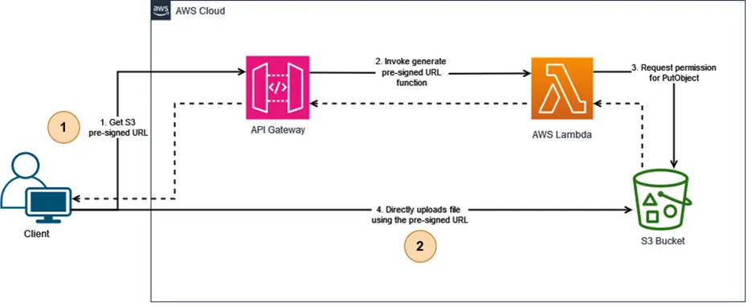

# 📄 Image Upload Guide (S3)

이 문서는 프로젝트에서 사용되는 이미지 업로드 Presigned URL 방식의 전체 구조,
백엔드/프론트 흐름, DB 저장 규칙, 보안 고려 사항을 정리한 가이드입니다.

## ❄️ 전체 아키텍처 흐름



1) 사용자 이미지 업로드 요청

   • 사용자가 업로드 버튼 / 드래그앤드롭 / 붙여넣기로 이미지 추가

   • 커서 위치에 blob: URL 먼저 삽입 → 즉시 미리보기 OK


2) 프론트는 서버에 업로드 요청 (POST /api/uploads)

   • 서버는 S3 presigned URL을 생성

   • 프론트는 해당 presigned URL로 파일을 업로드

   • 업로드 완료하면 finalUrl을 응답받음


3) 프론트는 본문에서 blob URL → finalUrl로 치환하여 미리보기 가능

   • 에디터 본문에 있는 ``를 찾아서

   • ``로 자동 변경

⸻

1. Presigned URL 방식이란?

Presigned URL 방식은 서버가 S3에 업로드할 수 있는 임시 URL을 발급하고,
클라이언트(브라우저)가 해당 URL을 사용해 이미지를 S3로 직접 업로드하는 방식입니다.

⸻

2. 왜 Presigned URL 방식을 선택하는가?

- ✔ 서버 부하가 거의 없음 (파일을 서버에서 받지 않음)
- ✔ 대용량 이미지 업로드에 강함
- ✔ 업로드 속도가 빠름 (브라우저 → S3 직통)
- ✔ 트래픽이 많아도 안정적 (S3가 부담)
- ✔ 업로드 후 즉시 CDN 캐싱 가능

이런 장점들로 인해 대부분의 SaaS/블로그/콘텐츠 에디터 서비스에서 표준 방식으로 사용됩니다.

⸻

3. S3 저장 vs DB 저장

- ✔ S3 → 이미지 파일 저장

- ✔ DB → 이미지 URL 또는 게시글 본문만 저장

❌ 이미지 파일을 DB에 직접 저장 ❌

- 추천 구조 (가장 단순 & 널리 쓰임)

  • 에디터 본문을 Markdown/HTML로 DB에 저장

  • 이미지 URL은 본문 안에 포함됨

⸻

4. 전체 업로드 흐름

1) 유저가 이미지 파일 선택
2) 프론트에서 blob URL을 생성해 즉시 에디터에 삽입 → 미리보기 표시
3) 프론트가 서버 API(/api/uploads)에 fileName, contentType만 전송
4) 서버는 S3 presigned URL과 최종 public URL을 생성하여 반환
5) 프론트가 해당 presigned URL로 S3에 파일 업로드 (PUT)
6) 업로드 성공 → 에디터 본문 내 blob URL을 S3 최종 URL로 치환
7) blob URL revoke()로 메모리 해제

⸻

5. AWS 설정

5.1 S3 버킷 생성

1. AWS Console → S3 → 버킷 만들기
2. 버킷 이름: fastcampus-finalproject-bucket
3. 리전: ap-northeast-2 (서울)
4. 퍼블릭 액세스 차단 설정 → 모두 해제 (이미지 공개 접근용)
5. 버킷 생성

5.2 버킷 정책 설정
버킷 → 권한 → 버킷 정책 → 편집:

```json
{
  "Version": "2012-10-17",
  "Statement": [
    {
      "Sid": "PublicReadGetObject",
      "Effect": "Allow",
      "Principal": "*",
      "Action": "s3:GetObject",
      "Resource": "arn:aws:s3:::fastcampus-finalproject-bucket/*"
    }
  ]
}
```

5.3 CORS 설정

버킷 → 권한 → CORS → 편집:

```json
[
  {
    "AllowedHeaders": [
      "*"
    ],
    "AllowedMethods": [
      "GET",
      "PUT",
      "POST",
      "HEAD"
    ],
    "AllowedOrigins": [
      "http://localhost:5173",
      "https://your-production-domain.com"
    ],
    "ExposeHeaders": [
      "ETag",
      "x-amz-meta-custom-header"
    ],
    "MaxAgeSeconds": 3000
  }
]
```

5.4 IAM 사용자 생성

1. AWS Console → IAM → 사용자 → 사용자 생성
2. 사용자 이름: s3-upload-user
3. 직접 정책 연결 → 정책 생성:

```json
{
  "Version": "2012-10-17",
  "Statement": [
    {
      "Effect": "Allow",
      "Action": [
        "s3:PutObject",
        "s3:GetObject",
        "s3:DeleteObject"
      ],
      "Resource": "arn:aws:s3:::fastcampus-finalproject-bucket/*"
    }
  ]
}
```

4. 사용자 생성 후 → 보안 자격 증명 → 액세스 키 만들기
5. Access Key ID와 Secret Access Key 저장 (한 번만 보임!)

⸻

6. 백엔드 설정 (Spring Boot)

6.1 의존성 추가

build.gradle:

```groovy
dependencies {
    // AWS SDK v2
    implementation platform('software.amazon.awssdk:bom:2.25.0')
    implementation 'software.amazon.awssdk:s3'
}
```

6.2 application.yml 설정

```yaml
cloud:
  aws:
    s3:
      bucket: fastcampus-finalproject-bucket
    region:
      static: ap-northeast-2
    credentials:
      access-key: ${AWS_ACCESS_KEY_ID}
      secret-key: ${AWS_SECRET_ACCESS_KEY}
```

6.3 S3 Config 클래스

```json
@Configuration
public class S3Config {

  @Value("${cloud.aws.credentials.access-key}")
  private String accessKey;

  @Value("${cloud.aws.credentials.secret-key}")
  private String secretKey;

  @Value("${cloud.aws.region.static}")
  private String region;

  @Bean
  public S3Presigner s3Presigner() {
      return S3Presigner.builder()
          .region(Region.of(region))
          .credentialsProvider(StaticCredentialsProvider.create(
          AwsBasicCredentials.create(accessKey, secretKey)
          ))
          .build();
  }
}
```

6.4 DTO 클래스

```java
@Getter
@NoArgsConstructor
public class UploadRequest {
    private String fileName;
    private String contentType;
}

@Getter
@AllArgsConstructor
public class UploadResponse {
    private String presignedUrl;  // S3에 PUT할 URL
    private String finalUrl;      // 업로드 완료 후 공개 URL
}
```

6.5 Service 클래스

```java

@Service
@RequiredArgsConstructor
public class S3UploadService {

    private final S3Presigner presigner;

    @Value("${cloud.aws.s3.bucket}")
    private String bucket;

    @Value("${cloud.aws.region.static}")
    private String region;

    public UploadResponse generatePresignedUrl(String originalFileName, String contentType) {
        // 고유한 파일명 생성 (중복 방지)
        String key = "uploads/" + UUID.randomUUID() + "_" + originalFileName;

        PutObjectRequest objectRequest = PutObjectRequest.builder()
                .bucket(bucket)
                .key(key)
                .contentType(contentType)
                .build();

        PresignedPutObjectRequest presignedRequest = presigner.presignPutObject(
                PutObjectPresignRequest.builder()
                        .signatureDuration(Duration.ofMinutes(10))
                        .putObjectRequest(objectRequest)
                        .build()
        );

        String finalUrl = String.format("https://%s.s3.%s.amazonaws.com/%s", bucket, region, key);

        return new UploadResponse(presignedRequest.url().toString(), finalUrl);
    }
}
```

6.6 Controller 클래스

```java

@RestController
@RequiredArgsConstructor
@RequestMapping("/api/uploads")
public class UploadController {

    private final S3UploadService s3UploadService;

    @PostMapping
    public ResponseEntity<UploadResponse> getPresignedUrl(@RequestBody UploadRequest request) {
        UploadResponse response = s3UploadService.generatePresignedUrl(
                request.getFileName(),
                request.getContentType()
        );
        return ResponseEntity.ok(response);
    }
}
```

6.7 환경변수 설정

.env 또는 시스템 환경변수:

```bash
AWS_ACCESS_KEY_ID=AKIA...
AWS_SECRET_ACCESS_KEY=...
```
